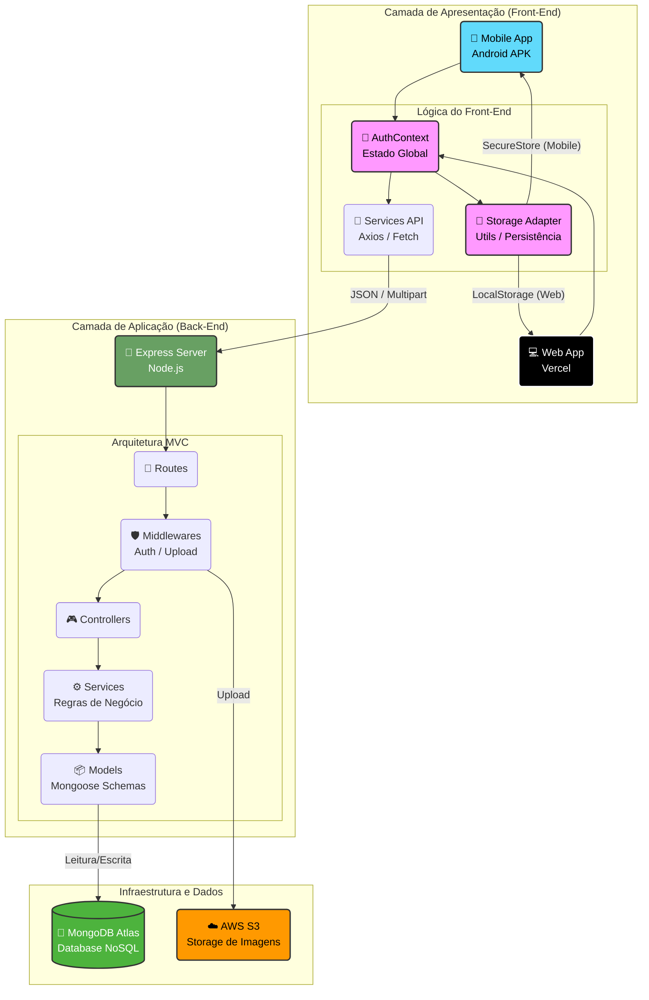
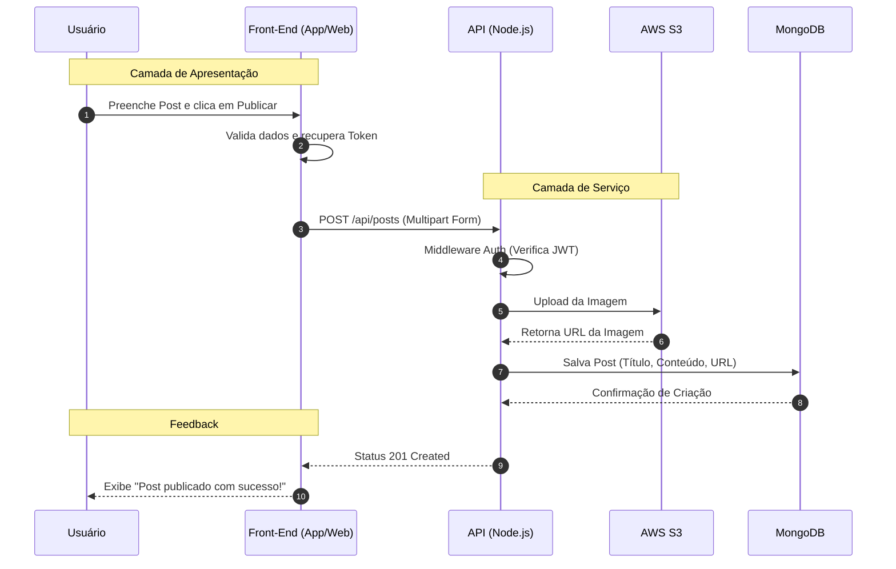

# LearniFy - Plataforma de Blogging Educacional


 


   

<br />

> **TCC - Análise e Desenvolvimento de Sistemas**
> Uma rede social acadêmica focada em mobile para conectar alunos e professores através do compartilhamento ágil de conhecimento.

---

<br />

## 📸 Demonstração

|                           Feed Principal (Mobile)                           |                              Upload de Imagem                               |                             Versão Web (Vercel)                              |
| :-------------------------------------------------------------------------: | :-------------------------------------------------------------------------: | :--------------------------------------------------------------------------: |
|  |  |  |

---

<br />

## 🛠 Tecnologias Utilizadas

O projeto foi desenvolvido utilizando uma arquitetura **Full-Stack JavaScript** moderna:

### 📱 Front-End (Mobile & Web)

- **React Native (Expo):** Framework core para desenvolvimento híbrido.
- **TypeScript:** Tipagem estática para maior segurança e manutenibilidade.
- **NativeWind (TailwindCSS):** Estilização utilitária e responsiva.
- **Axios & Fetch:** Comunicação com API e upload de arquivos `multipart/form-data`.
- **Context API:** Gerenciamento de estado global (Autenticação).
- **Expo SecureStore:** Armazenamento seguro de tokens no dispositivo.

### ⚙️ Back-End (API REST)

- **Node.js & Express:** Servidor de alta performance.
- **CI/CD:** **GitHub Actions**
- **MongoDB Atlas:** Banco de dados NoSQL na nuvem.
- **Docker** e **Docker Compose**
- **AWS S3:** Armazenamento de objetos (imagens dos posts).
- **Jest & Supertest:** Testes automatizados de integração.
- **Swagger (OpenAPI):** Documentação automática da API.

---

<br />

## 🏗 Arquitetura e Desafios

### Arquitetura em Camadas

Adotamos o padrão **MVC (Model-View-Controller)** no Back-End para separar responsabilidades:

1.  **Models:** Schemas do Mongoose (User, Post, Comment).
2.  **Services:** Regras de negócio (ex: lógica de like, comunicação com S3).
3.  **Controllers:** Validação de entrada e resposta HTTP.

### Desafios Superados

1.  **Compatibilidade Web:** O uso de bibliotecas nativas como `SecureStore` quebrou a versão web. **Solução:** Implementamos um padrão _Adapter_ (`storage.ts`) que detecta a plataforma e alterna automaticamente entre `localStorage` (Web) e `SecureStore` (Mobile).
2.  **Upload no Android:** O Axios apresentou instabilidade com `FormData` no Android. **Solução:** Utilizamos a API nativa `fetch` para uploads, garantindo a integridade dos dados binários.

_Passei dias tentando fazer funcionar o Upload e mesmo assim tive que desistir do Upload da imagem de perfil Kkkkkkkkk mas valeu a pena_

---

<br />

## 🏗️ Arquitetura Geral do Sistema (Full-Stack)



---

<br />

## 🔄 Fluxo de Dados e Arquitetura

Para garantir a escalabilidade e a organização do código, o **LearniFy** segue um fluxo rigoroso de dados entre as camadas do Front-End e do Back-End. Abaixo detalhamos o ciclo de vida de uma requisição típica (ex: **Criar um Post**).

### 📱 1. Fluxo Front-End (Mobile/Web)

No lado do cliente, a responsabilidade é capturar a intenção do usuário e enviá-la de forma segura.

1.  **View (Screens):** O usuário preenche o formulário na tela `CreatePost.tsx` e clica em "Publicar".
2.  **Validation:** O Front-End valida os dados básicos (ex: campos vazios) antes de gastar dados de rede.
3.  **Service Layer:** O arquivo `src/services/api.ts` (configurado com Axios/Fetch) intercepta a chamada.
4.  **Auth Context:** O `api.ts` verifica se existe um token no `storage.ts` (SecureStore ou LocalStorage) e o anexa ao cabeçalho da requisição (`Authorization: Bearer <token>`).
5.  **Network Request:** A requisição HTTP (POST) é disparada para a API no Render.

### ⚙️ 2. Fluxo Back-End (API)

Ao receber a requisição, o servidor processa os dados seguindo a arquitetura MVC.

1.  **Route:** O arquivo `routes/postRoutes.ts` recebe a chamada.
2.  **Middlewares:**
    - `auth.ts`: Verifica a validade do Token JWT.
    - `upload.ts`: Intercepta a imagem e faz o upload para o **AWS S3**.
3.  **Controller:** O `postController.ts` recebe os dados limpos e a URL da imagem gerada pelo S3.
4.  **Service:** O `postService.ts` aplica as regras de negócio (ex: associar o post ao ID do usuário logado).
5.  **Model:** O Schema `models/Post.ts` cria o documento e o salva no banco **MongoDB Atlas**.
6.  **Response:** O servidor retorna o status `201 Created` para o Front-End, que exibe o feedback de sucesso ao usuário.

---

<br />

## 📂 Estrutura de Pastas

A estrutura do projeto foi cuidadosamente organizada para seguir as melhores práticas de desenvolvimento, garantindo uma clara separação de responsabilidades

```
/Back-End (API REST)
├── .github/workflows       # Pipelines de CI/CD (Testes e Deploy automáticos)
├── src/
│   ├── config/             # Configurações globais (S3, Swagger, variáveis de ambiente)
│   ├── controllers/        # Controladores: recebem requisições HTTP e devolvem respostas
│   ├── middlewares/        # Interceptadores (Autenticação JWT, Upload de arquivos Multer)
│   ├── models/             # Schemas do MongoDB (User, Post, Comment)
│   ├── routes/             # Definição das rotas da API (Endpoints)
│   ├── services/           # Regras de negócio e comunicação com o Banco de Dados
│   ├── tests/              # Testes automatizados (Jest/Supertest)
│   ├── utils/              # Funções auxiliares (Tratamento de erros assíncronos)
│   ├── app.ts              # Configuração principal do Express (CORS, JSON)
│   └── server.ts           # Ponto de entrada: inicializa o servidor e conecta ao DB
├── Dockerfile              # Receita para containerização da aplicação
├── jest.config.js          # Configuração do framework de testes
├── jest.setup.ts           # Script de setup que roda antes da suíte de testes (ex: conectar ao DB de teste).
└── package.json            # Dependências e scripts do projeto

/Front-End (Mobile & Web)
├── src/
│   ├── context/            # Gerenciamento de estado global (AuthContext - Login/Logout)
│   ├── routes/             # Navegação do App (Stack, Tab Navigation e proteção de rotas)
│   ├── screens/            # Telas da aplicação
│   │   ├── admin/          # Painel Administrativo (Gestão de Posts, Usuários)
│   │   ├── auth/           # Fluxos de entrada (Login, Cadastro, Recuperar Senha)
│   │   ├── home/           # Feed principal e Detalhes do Post
│   │   ├── learn/          # Área de cursos e aprendizado
│   │   ├── post/           # Criação e Edição de publicações (Upload de Imagem)
│   │   └── profile/        # Perfil do usuário e edição
│   ├── services/           # Comunicação com a API (Axios)
│   └── utils/              # Utilitários (Storage Adapter para compatibilidade Web/Mobile)
├── app.json                # Configurações do Expo (Nome, Ícone, Splash Screen)
├── App.tsx                 # Componente raiz (Configuração de Layout Responsivo)
└── global.css              # Estilização global com NativeWind (Tailwind)
```

---

<br />

### 📊 Diagrama de Sequência (Full-Stack) - _Só pra testar o Mermaid :D_



---

<br />

## 🚀 Como Rodar o Projeto

### Pré-requisitos

- Node.js (v18+)
- Conta no Expo (para rodar no celular)
- Docker (opcional, para rodar banco localmente)

### 1. Back-End

```bash
cd Back-End
npm install
# Crie um arquivo .env com suas chaves (MONGO_URI, AWS_KEYS...)
npm run dev
# Para rodar os testes:
npm test
```

### 2. Front-End

```bash
cd Front-End
npm install
# Rodar no celular/emulador:
npx expo start
# Rodar na Web (modo dev):
npx expo start --web
```

---

<br />

## 🧪 Testando a API

### Com a Documentação Swagger

A forma mais fácil de explorar e testar a API é através da documentação interativa.

- **Acesse:** [http://localhost:3000/api-docs](http://localhost:3000/api-docs) ou [https://tcc4-learnify-rnmobile-fullstack.onrender.com/api-docs](https://tcc4-learnify-rnmobile-fullstack.onrender.com/api-docs)

Lá você poderá ver todos os endpoints, seus parâmetros e schemas, além de poder executar requisições diretamente do navegador.

### Com Testes Automatizados

O projeto conta com uma suíte de testes de integração robusta. Para executá-la:

1.  Certifique-se de que as dependências de desenvolvimento estão instaladas:
    ```bash
    npm install
    ```
2.  Execute os testes:
    ```bash
    npm run test
    ```
    Isso irá rodar todos os testes e gerar um relatório de cobertura de código na pasta `/coverage`.

## ⚙️ Pipeline de CI/CD

Este projeto utiliza **GitHub Actions** para automação. A cada `push` ou `pull request` na branch `main`:

1.  O ambiente é configurado com a versão correta do Node.js e um banco de dados MongoDB de teste.
2.  As dependências são instaladas.
3.  A suíte de testes completa é executada para garantir que nenhuma funcionalidade foi quebrada.

## 📦 Deploy e Entrega

- **API:** Hospedada no Render.

- **Web App:** Hospedado na Vercel.

- **Mobile:** APK gerado via Expo EAS.

---

 <br />
<br />

<div align="center">
  
  <a href="https://github.com/RNanWP">
    
  </a>
  <a href="https://www.linkedin.com/in/renanodev/">
    
  </a>

  <br />
  <br />

  <p>
    Direitos autorais © 2025 <b>RenanODev Pós-Tech</b>. <br />
    Todos os direitos reservados.
  </p>
</div>
